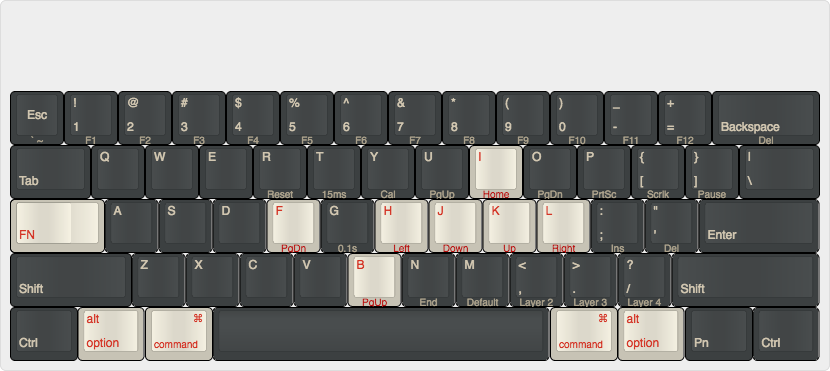

# Pok3r keyboard layout for macOS
This is my personal keyboard layout for the Pok3r keyboard.

I utilize layer 3 when using macOS &mdash; to enable press `FN + .` which will light up the red LED underneath the space bar.

## General Pok3r programming info
* [Pok3r User Manual](http://www.vortexgear.tw/db/upload/webdata4/6vortex_20166523361966663.pdf) on Vortex's site
* Factory reset
    * Resets all layers
    * Hold both the left and right `ALT` keys
* Reset selected layer only
    * `FN + R` until LED under spacebar stops flashing

## Move `FN` to `CapsLock`
Allows for ergonomic use of `HJKL` as cursor keys.

* Switch to layer 3 ; programming is per layer
* Unplug keyboard
* Set DIP switch 3 to `ON`
* Plugin keyboard again

## Key Reprogramming
The default layer (layer 1) cannot be programmed.  Layers 2-4 can have keys reprogrammed.  In order to start reprogramming individual keys, enter into the layer desired.  To enter into layer 3 press `FN + .`.

To program a key perform the following:
* Start programming mode -- `FN + R_Ctrl`
    * A second LED underneath the space bar will be lit.
* Remap key -- press the key to be re-programmed (`original key`) and then press the key to be mapped (`new key`)
    * During this step, all keys are as labelled on the keyboard and not based on re-programming that previously occured.
    * A key may be remapped up to 32 characters.
* Confirm remapping -- `PN`
    * The second LED will blink while programming.
* Exit programming mode -- `FN + R_Ctrl`
    * The second LED will no longer be lit.

## Layer 3 (Red) for macOS:
Enter into layer 3 -- `FN + .` -- in order to move the following keys.  Note that **New Key** is based on the original keyboard layout (as keys are physically labeled on the keyboard).

| Original Key | New Key    | Notes / Instructions |
|--------------|------------|----------------------|
| `FN`         | `CapsLock` | [Move FN](#Move_FN)  |
| `FN + H`     | `FN + J`   | Left (vim like)      |
| `FN + J`     | `FN + K`   | Down (vim like)      |
| `FN + K`     | `FN + I`   | Up (vim like)        |
| no change    | no change  | Right (vim like)     |
| `FN + F`     | `FN + O`   | PgDown (vim like)    |
| `FN + B`     | `FN + U`   | PgUp (vim like)      |
| `L_ALT`      | `L_WIN`    | Swap Alt / Cmd       |
| `L_WIN`      | `L_ALT`    | Swap Alt / Cmd       |

macOS Layout on [keyboard-layout-editor.com](http://www.keyboard-layout-editor.com#/gists/54174130972fd7be2d6efe5948dfd3cc)

## Source
Forked from [David Jenni](https://github.com/davidjenni/pok3r-layouts)
 
 This work is licensed under a <a rel="license" href="http://creativecommons.org/licenses/by-sa/4.0/">Creative Commons Attribution-ShareAlike 4.0 International License</a>.
