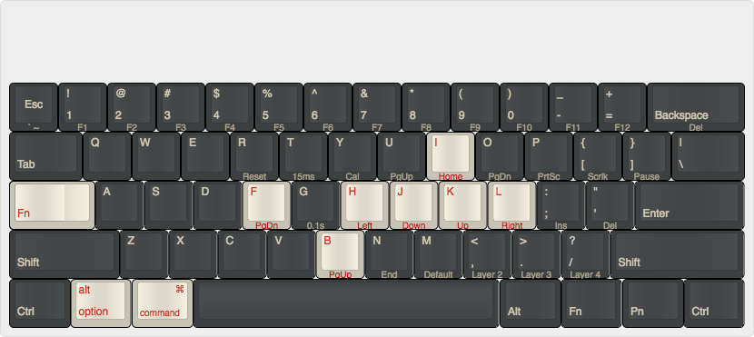

# Pok3r keyboard layout for OSX
This is my personal keyboard layout for the Pok3r keyboard.

I utilize layer 3 when using OSX -- to enable press `FN + .` which will light up the red LED underneath the space bar.

## General Pok3r programming info
* [Pok3r User Manual](http://www.vortexgear.tw/db/upload/webdata4/6vortex_20166523361966663.pdf) on Vortex's site
* Factory reset -- Hold both the left and right `ALT` keys
* Reset selected layer only -- `FN + R` until LED under spacebar stops flashing

### Programming of layers 2-4:
The default layer (layer 1) cannot be programmed.  In order to start programming individual keys, enter into the layer desired.  To enter into layer 3 press `FN + .`.

To program a key perform the following:
* Start programming mode -- `FN + R_Ctrl`
  * A second LED underneath the space bar will be lit.
* Remap key -- press the key to be re-programmed (`target key`) and then press the key to be mapped (`new key`)
  * During this step, all keys are as labelled on the keyboard and not based on re-programming that previously occured.
  * A key may be remapped up to 32 characters.
* Confirm remapping -- `PN`
  * The second LED will blink while programming
* Exit programming mode -- `FN + R_Ctrl`
  * The second LED will no longer be lit

<start here>

## Layer 3 (Red) for OSX:
`FN + .` to switch to Layer  3
* [Move FN to L_Ctrl](#Move_FN)
* `FN + R_Ctrl` to enter programming
* [Common bindings](#common_bindings)
* Swap Cmd/Opt keys on both sides of space bar:
  * L_Cmd: `L_Alt` then: `L_WIN` then: `PN`
  * L_Option: `L_WIN` then: `L_Alt` then: `PN`
  * R_CMD: `R_Alt` then: `R_FN` (Win) then: `PN`
  * R_Option: `R_FN` (Win) then: `R_Alt` then: `PN`
* `FN + R_Ctrl` to exit programming

Resulting programming:

OSX Layout on [keyboard-layout-editor.com](http://www.keyboard-layout-editor.com/##@_name=Pok3r%20Layer%203%20for%20OSX%2F%2FMac&author=davidjenni&notes=See%20%5Bgithub%5D(https%2F:%2F%2F%2F%2Fgithub.com%2F%2Fdavidjenni%2F%2Fpok3r-layouts)%3B&@_y:1.5&c=%233c4041&t=%23aba18b&p=DCS&a:5%3B&=%0A%0A%0A%0A%60%20~%0A%0AEsc&_a:4%3B&=!%0A1%0A%0A%0AF1&=%2F@%0A2%0A%0A%0AF2&=%23%0A3%0A%0A%0AF3&=$%0A4%0A%0A%0AF4&=%25%0A5%0A%0A%0AF5&=%5E%0A6%0A%0A%0AF6&=%2F&%0A7%0A%0A%0AF7&=*%0A8%0A%0A%0AF8&=(%0A9%0A%0A%0AF9&=)%0A0%0A%0A%0AF10&=%2F_%0A-%0A%0A%0AF11&=+%0A%2F=%0A%0A%0AF12&_w:2%3B&=%0ABackspace%0A%0A%0ADel%3B&@_w:1.5%3B&=%0ATab&=Q&=W&=E&=R%0A%0A%0A%0AReset&=T%0A%0A%0A%0A15ms&=Y%0A%0A%0A%0ACal&=U%0A%0A%0A%0APgUp&_c=%23c7c3b5&t=%23ba1312%3B&=I%0A%0A%0A%0AHome&_c=%233c4041&t=%23aba18b%3B&=O%0A%0A%0A%0APgDn&=P%0A%0A%0A%0APrtSc&=%7B%0A%5B%0A%0A%0AScrlk&=%7D%0A%5D%0A%0A%0APause&_w:1.5%3B&=%7C%0A%5C%3B&@_c=%23c7c3b5&t=%23ba1312&w:1.25&w2:1.75%3B&=%0ACtrl&_x:0.5&c=%233c4041&t=%23aba18b%3B&=A&=S&=D&_c=%23c7c3b5&t=%23ba1312%3B&=F%0A%0A%0A%0APgDn&_c=%233c4041&t=%23aba18b%3B&=G%0A%0A%0A%0A0.1s&_c=%23c7c3b5&t=%23ba1312%3B&=H%0A%0A%0A%0ALeft&=J%0A%0A%0A%0ADown&=K%0A%0A%0A%0AUp&=L%0A%0A%0A%0ARight&_c=%233c4041&t=%23aba18b%3B&=%2F:%0A%2F%3B%0A%0A%0AIns&=%22%0A'%0A%0A%0ADel&_w:2.25%3B&=%0AEnter%3B&@_w:2.25%3B&=%0AShift&=Z&=X&=C&=V&_c=%23c7c3b5&t=%23ba1312%3B&=B%0A%0A%0A%0APgUp&_c=%233c4041&t=%23aba18b%3B&=N%0A%0A%0A%0AEnd&=M%0A%0A%0A%0ADefault&=%3C%0A,%0A%0A%0ALayer%202&=%3E%0A.%0A%0A%0ALayer%203&=%3F%0A%2F%2F%0A%0A%0ALayer%204&_w:2.75%3B&=%0AShift%3B&@_c=%23c7c3b5&t=%23ba1312&w:1.25%3B&=%0AFN&_w:1.25%3B&=%0AOption&_w:1.25%3B&=%0ACMD&_c=%233c4041&t=%23aba18b&p=DCS%20SPACE&w:6.25%3B&=&_c=%23c7c3b5&t=%23ba1312&p=DCS&w:1.25%3B&=%0ACMD&_w:1.25%3B&=%0AOption&_c=%233c4041&t=%23aba18b&w:1.25%3B&=%0APn&_w:1.25%3B&=%0ACtrl)

## Common key bindings for all OSs
* CapsLock always as Ctrl:
  * `CapsLock` then: `L_Ctrl` then: `PN` to confirm
  * `FN + CapsLock` then: `L_Ctrl` then: `PN` to confirm
* VIM like HJKL and Page Up/Down:
  * Left: `FN + H` then: `FN + J` then: `PN`
  * Down: `FN + J` then: `FN + K` then: `PN`
  * Up: `FN + K` then: `FN + I` then: `PN`
  * PgDown: `FN + F` then: `FN + O` then: `PN`
  * PgUp: `FN + B` then: `FN + U` then: `PN`
* Home: `FN + I` then: `FN + H` then: `PN`
* Volume controls:
  * Mute: `FN + X` then: `FN + /?` then: `PN`
  * Vol-: `FN + C` then: `FN + ,<` then: `PN`
  * Vol+: `FN + V` then: `FN + .>` then: `PN`

## Move FN to L_Ctrl
HJKL as cursor keys are more ergonomical to reach by moving the FN to the left Ctrl key location:
* Switch to Layer 2 (or 3, 4); this programming is per layer
* Unplug keyboard
* DIP switch 4 to ON
* Plugin keyboard again, then press `FN` then: `L_Ctrl` then: `PN` then: `PN` (to leave it in its original location)
* DIP switch 4 back to OFF (no need to unplug)

## Source
Forked from [David Jenni](https://github.com/davidjenni/pok3r-layouts)
 
 This work is licensed under a <a rel="license" href="http://creativecommons.org/licenses/by-sa/4.0/">Creative Commons Attribution-ShareAlike 4.0 International License</a>.
